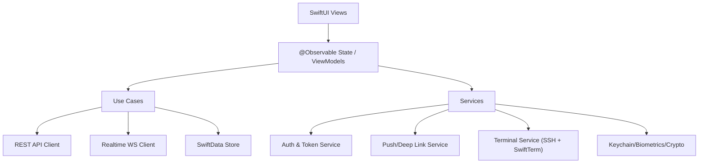

# iOS Agent Observability App — Detailed Architecture & Execution Spec (v2, aligned)

**Status:** Updated Draft  
**Owner:** iOS Agent (implementation) + Platform Agent (contracts)  
**Date:** Dec 27, 2025  
**Parent PRDs:** PRD-00 (Master), PRD-01 (Memory/Context), PRD-02 (Skills), PRD-03 (Orchestration), PRD-04 (Debugging)  
**Child spec:** `Terminal_Subsystem_Execution_Spec_v2.md` (terminal/SSH/tmux details)

---

## 0. Purpose of this document

This spec is intentionally **task-generative**: each section contains **explicit deliverables, acceptance criteria, and dependencies** so an execution agent can:

1. create a work plan  
2. implement in small slices  
3. validate via checks/tests  
4. ship with minimal human intervention  

---

## 1. Scope

### 1.1 In-scope (MVP → V1)

**Mobile is not just "tmux on a phone."** It must cover:

1. **Live session streaming** (read-only): traces + logs timeline (PRD-04)  
2. **Swarm health dashboard** + drilldowns (PRD-03)  
3. **Orchestration controls** (safe controls): pause/resume/terminate at swarm + agent level (PRD-03/04)  
4. **Approval gates** via push (PRD-03)  
5. **Context health** overview + alerts (PRD-01)  
6. **Skill health** overview + alerts (PRD-02)  
7. **Secure terminal session viewing** (tmux) via SSH over a secure network (PRD-00)  

### 1.2 Explicitly out-of-scope (for now)

- Full historical analytics & replay (web/TUI primary)  
- Skill authoring / editing (future)  
- Local agent execution on-device  
- Cross-platform Android parity (separate doc)  

---

## 2. North Star & success metrics

### 2.1 North Star

> "I can diagnose and mitigate an agent incident from my phone in <60 seconds."

### 2.2 Success metrics (instrumented)

- **TTA (Time-to-Awareness):** push → open incident screen < 5s median  
- **TTM (Time-to-Mitigation):** open app → pause/terminate action < 60s median  
- **Streaming latency:** backend event timestamp → UI render p50 < 300ms (foreground)  
- **Battery:** ≤ 3% drain per 10 minutes while actively streaming (foreground, typical incident)  
- **Crash-free sessions:** 99.5%+  

---

## 3. Guiding principles

1. **Native-first**: SwiftUI + modern state model  
2. **Foreground streaming, background notifications**: don't pretend iOS will keep sockets alive in background  
3. **Safety-first controls**: destructive actions require confirmations + rate limits + (future) role checks  
4. **Performance budgets are enforced**: not "nice to have"  
5. **Contracts-first**: backend schema + WS protocol must be explicit and versioned  

---

## 4. Platform assumptions & constraints

### 4.1 Target platforms

- iOS 18+ (preferred), iPadOS 18+ (universal layout)  
- Swift 6 language mode; strict concurrency enabled (build must pass without data race warnings)  

### 4.2 Background limitations (design constraint)

- Realtime streaming is **best-effort** outside foreground  
- Primary "on-the-go monitoring" = **push notifications + quick open + cached summaries**  

### 4.3 Terminal networking constraint (locked)

- Terminal connectivity uses **system VPN / tailnet** (e.g., Tailscale app / WireGuard profile).  
- The app **does not** embed a VPN SDK.  
- If host unreachable, UI should surface "Tailscale/VPN not connected" guidance.

---

## 5. High-level architecture

### 5.1 Layered modules

- **UI Layer (SwiftUI)**: screens & components  
- **Presentation Layer**: `@Observable` view models/state  
- **Domain Layer**: typed entities + use-cases  
- **Data Layer**: API client, WebSocket client, persistence  
- **Services**: auth, push, security, terminal, deep links  
- **Core**: logging, DI, utilities, feature flags  

### 5.2 Diagram



---

## 6. Feature map (PRD alignment)

### 6.1 Required screens (V1)

1. **Home / Overview**
   - list: active incidents, active swarms, active sessions  
   - rollups: context risk, skill failure rate, swarm health  

2. **Swarm Health**
   - swarm cards w/ status, active agents, error rate, throughput  
   - drilldown to agent list  
   - safe controls (pause/resume/terminate swarm)  

3. **Agent Detail**
   - state: running/paused/error/waiting  
   - last N events  
   - context health  
   - top failing skills  
   - safe controls (pause/resume/terminate agent)  

4. **Live Trace & Logs (Read-only stream)**
   - unified timeline (spans/events/logs/tool calls)  
   - filters: severity, agent, skill/tool, time window  
   - "Open in Web" deep link  

5. **Approval Gates Inbox**
   - push → open gate → approve/reject  
   - show context: who/what/why, impact, audit trail  

6. **Context Health**
   - per session: token usage, redundancy score, near-capacity warnings  
   - simple charts (sparklines ok) + thresholds  

7. **Skill Health**
   - key skills: success/failure, latency, spike detection  
   - alerts configuration (thresholds)  

8. **Terminal Sessions (tmux viewer)**
   - sessions list (source: backend mapping endpoint **or** manual local config for MVP)  
   - connect to selected session via SSH + attach tmux over **system VPN/tailnet**  
   - default to **read-only**; allow an optional "Enable Input" toggle (policy can tighten later)  

### 6.2 Push notification types (V1)

- Critical error (incident)  
- Approval gate waiting  
- Context near capacity / redundancy spike  
- Skill failure spike  
- Swarm degradation (error rate / stuck agents)  

---

## 7. Data contracts (proposed; backend is currently undefined)

> Since backend is not defined yet, treat the following as **proposed contracts** required for iOS implementation.
> Field names can change, but the **shape + semantics** must remain stable once v1 ships.

### 7.1 REST endpoints (minimum)

**Auth**
- `POST /v1/auth/device/register` → device token handshake  
- `POST /v1/auth/token/refresh`

**Overview**
- `GET /v1/overview` → summary cards + lists  

**Swarms / Agents**
- `GET /v1/swarms?status=active`  
- `GET /v1/swarms/{swarmId}`  
- `GET /v1/agents/{agentId}`  

**Controls (safe)**
- `POST /v1/swarms/{swarmId}/control` body: `{ action: "pause|resume|terminate", reason, requestId }`  
- `POST /v1/agents/{agentId}/control` body: same  

> **Authorization note (no role model yet):**
> - For MVP, server may accept authenticated operator actions without granular RBAC.
> - All control actions MUST still be audited (who/when/why/requestId).
> - Future: add role/permission checks (RBAC/ABAC) without changing endpoint shapes.

**Approval gates**
- `GET /v1/approval-gates?status=pending`  
- `POST /v1/approval-gates/{gateId}/decision` body: `{ decision:"approve|reject", reason }`  

**Terminal sessions mapping**
- `GET /v1/terminal/sessions`  
- (optional) `GET /v1/terminal/sessions/{id}` → includes host tailnet IP/hostname + tmux session name + auth mode  

> **MVP alternative (no backend):**
> - Terminal hosts + tmux session names can be configured locally in Settings.
> - This should be implemented so terminal shipping is not blocked on backend.

**Deep links**
- Web URLs returned by API for incident/session/trace to avoid client guessing:
  - `incident.webUrl`  
  - `trace.webUrl`  

### 7.2 WebSocket protocol (foreground streaming)

Single WS endpoint:
- `wss://…/v1/stream`

Client subscribes:
```json
{
  "type": "subscribe",
  "requestId": "uuid",
  "filters": {
    "swarmIds": ["..."],
    "agentIds": ["..."],
    "severityGte": "warn",
    "include": ["traceEvents", "logs", "metrics", "approvals"]
  }
}
```

Server events (examples):
```json
{ "type":"traceEvent", "ts": 173... , "agentId":"...", "spanId":"...", "name":"tool.call", "attrs": { } }
{ "type":"log", "ts": 173... , "agentId":"...", "level":"error", "message":"..." }
{ "type":"metric", "ts": 173... , "scope":"swarm", "swarmId":"...", "name":"error_rate", "value":0.12 }
{ "type":"approvalGate", "ts":173..., "gateId":"...", "status":"pending", "summary":"Deploy fix?" }
```

**Protocol requirements**
- Versioning: `?protocol=1`  
- Heartbeats: server sends `ping`; client responds `pong`  
- Backpressure: server supports `maxEventsPerSecond` in subscription; client may send `throttle`  
- Reconnect: resume with `lastEventId` (optional but recommended)  

---

## 8. Local data model (SwiftData)

### 8.1 Entities (minimum)

- `DeviceIdentity`
  - `id`, `createdAt`, `pushToken`, `authState`
- `Swarm`
  - `id`, `name`, `status`, `activeAgents`, `errorRate`, `updatedAt`
- `Agent`
  - `id`, `swarmId`, `status`, `taskSummary`, `updatedAt`
- `Incident`
  - `id`, `severity`, `summary`, `swarmId?`, `agentId?`, `createdAt`, `status`, `webUrl`
- `ApprovalGate`
  - `id`, `status`, `summary`, `requestedAt`, `expiresAt?`, `webUrl?`
- `ContextHealth`
  - `sessionId`, `tokenUsage`, `maxTokens`, `redundancyScore`, `warnings[]`, `updatedAt`
- `SkillHealth`
  - `skillId`, `name`, `successRate`, `errorRate`, `p95LatencyMs`, `updatedAt`
- `TraceBuffer`
  - bounded buffer metadata per `agentId/sessionId` (do not persist entire firehose)

### 8.2 Storage rules

- Persist **summaries and last-known state**  
- For streaming events: keep **bounded in-memory ring buffer**; optionally persist last 200 events per active incident only  

---

## 9. Realtime & performance budgets (enforced)

### 9.1 Performance budgets (hard requirements)

- **UI thread**: no synchronous parsing/rendering of > 5ms blocks  
- **Timeline screen**: maintain 60fps; degrade gracefully to 30fps in Low Power Mode  
- **Memory**: streaming buffer ≤ 25MB total  
- **Network**:
  - default stream cap: 200 events/sec (client configurable)  
  - compression optional (server-driven)  

### 9.2 Backpressure plan

- Parse events off-main (actor/Task)  
- Coalesce UI updates (e.g., apply batched diff every 100–250ms)  
- Drop or compact high-frequency logs:
  - collapse identical messages with count  
  - summarize noisy debug logs into "N suppressed"  

### 9.3 Observability of the iOS app itself

- OSLog categories: `ui`, `ws`, `api`, `terminal`, `push`, `storage`  
- Signpost key flows: app launch, connect stream, subscribe, render batch, approval decision, control action  

---

## 10. Security model

### 10.1 Auth & device trust

- Device registers once; gets refresh token stored in Keychain  
- Every control action requires:
  - valid auth token  
  - `requestId` for idempotency  
  - server-side audit logging (actor, reason, timestamp, requestId, outcome)  
- **Role/permission checks:** not defined yet; treat as future enhancement without changing endpoint shapes.

### 10.2 Biometric gating

- Gate entry to:
  - Terminal feature  
  - Destructive controls (terminate)  
- Use "biometric with fallback passcode" policy  

### 10.3 Terminal network security strategy (locked)

- User runs Tailscale/secure network on device (system VPN)  
- App connects via SSH to a **tailnet IP/hostname** provided by backend **or** manual config for MVP  
- App enforces SSH **host key verification (TOFU)**: store fingerprint on first connect; block on mismatch; biometric-gated reset trust

### 10.4 SSH key handling (aligned with child spec)

- Keys stored in Keychain; for Ed25519 store **raw key bytes as generic password data** with `ThisDeviceOnly` accessibility (optional biometric access control)  
- Support:
  - ed25519 keypairs  
  - agent-less auth (no local ssh-agent)  
- Never log secrets  

---

## 11. Terminal subsystem (tmux viewer)

**Authoritative design + task breakdown:** `Terminal_Subsystem_Execution_Spec_v2.md`

### 11.1 Components

- `TerminalService` (public façade)  
- `SSHTransport` (protocol)  
- `SSHConnectionManager` (actor; owns networking/multiplexing)  
- `TmuxClient` (list/create/attach/kill; discovery on reconnect)  
- `TerminalViewWrapper` (SwiftTerm integration)  
- `KeychainKeyStore` + `HostKeyStore` (TOFU fingerprints + keys)  

### 11.2 SSH library choice (implementation requirement; current recommendation)

- Preferred: **SwiftNIO SSH** transport behind `SSHTransport` protocol  
- Must support:
  - PTY + shell channel for interactive tmux attach  
  - multiplexed channels over a single connection  
  - reconnect flow (active session first)

### 11.3 Terminal flows (high level)

1. Determine session mapping (backend or manual config)  
2. Connect SSH over tailnet (system VPN)  
3. Verify host key (TOFU)  
4. Open PTY + shell and attach `tmux attach -t <name>`  
5. Render terminal output in SwiftTerm view  
6. Background: detach/close channels; Foreground: reconnect + rediscover + reattach on-demand  

---

## 12. UX specifications (screen-by-screen)

> Each screen includes "Data", "Actions", "States", "Acceptance".

### 12.1 Home / Overview

**Data**
- `overview.summaryCards`
- `overview.activeIncidents[]`
- `overview.activeSwarms[]`

**Actions**
- Tap incident → Incident Detail (Agent Detail + Live Trace)
- Tap swarm → Swarm Health
- Pull to refresh (REST)

**States**
- loading / loaded / error / offline

**Acceptance**
- Cold open shows cached summary in < 500ms, then refreshes
- Tapping incident opens correct detail; deep link support works

### 12.2 Swarm Health

**Data**
- swarm list + metrics
- drilldown: agent list

**Actions**
- pause/resume/terminate swarm (confirm sheet)
- select agent

**Acceptance**
- Control action yields visible state update within 2 seconds (via WS or REST poll fallback)
- Terminate requires biometric + typed confirm ("TERMINATE")

### 12.3 Agent Detail

**Data**
- agent status, current task, last 50 events summary
- context health, skill health rollup

**Actions**
- pause/resume/terminate agent
- open Live Trace filtered to agent
- open Terminal session (if mapped)

**Acceptance**
- Works offline for last-known state
- Control actions are idempotent (repeat doesn't create duplicates)

### 12.4 Live Trace & Logs

**Data**
- streaming event list (bounded)
- filters

**Actions**
- filter chips, search
- "Open in Web"
- copy event JSON (debug)

**Acceptance**
- Rendering stays smooth under 200 events/sec with batching
- Filters apply without blocking UI thread

### 12.5 Approval Gates Inbox + Detail

**Data**
- pending gates
- gate context blob (summary, risk, recommended action)

**Actions**
- approve/reject
- require reason for reject (min length rule)
- audit receipt shown after decision

**Acceptance**
- Push tap opens correct gate
- Decision shows server-confirmed status + timestamp

### 12.6 Context Health

**Data**
- per session: token usage, max, redundancy score, warnings

**Actions**
- adjust alert thresholds (client UI; server stores)
- terminate session shortcut

**Acceptance**
- "near capacity" alert triggers push (server-driven); app renders alert card

### 12.7 Skill Health

**Data**
- key skills summary list
- detail: last hour/day, p95 latency, error rate

**Actions**
- set threshold notifications
- future: disable skill (not in V1)

**Acceptance**
- "critical skill failure" push opens skill detail and related incident

### 12.8 Terminal Sessions

**Data**
- sessions list, status, mapped agent/swarm

**Actions**
- connect, disconnect, reconnect
- copy host
- (future) input enabled toggle

**Acceptance**
- Connect + first paint < 3s on good network
- If SSH fails, user gets actionable error category (auth vs network vs host key)

---

## 13. Error handling taxonomy (must be user-actionable)

Define standard error types:

- `NetworkUnavailable`
- `AuthExpired`
- `PermissionDenied`
- `RateLimited`
- `ServerError`
- `ProtocolMismatch`
- `SSHAuthFailed`
- `SSHHostUnreachable` (tailnet down / VPN off)
- `SSHHostKeyMismatch`
- `TmuxSessionNotFound`
- `TerminalInitFailed`

**UI rules**
- Each error maps to:
  - title
  - 1-line explanation
  - primary action (Retry / Re-auth / Open Settings / Copy debug)

---

## 14. Implementation plan (agent-executable)

### 14.1 Phases

**Phase A — Foundation (Week 1 equivalent)**
- App shell, DI, navigation, auth bootstrap, persistence
- Overview screen (REST + cache)
- Push registration plumbing

**Phase B — Realtime Streaming (Week 2)**
- WS client + subscriptions + bounded buffer
- Live Trace screen (read-only)
- Incident deep links from push

**Phase C — Swarms + Controls (Week 3)**
- Swarm/Agent screens
- Safe controls with idempotency + biometric gating
- Approval gates inbox + decision

**Phase D — Context + Skills (Week 4)**
- Context + Skill dashboards + alert settings UI

**Phase E — Terminal (Week 5)**
- Implement terminal per `Terminal_Subsystem_Execution_Spec_v2.md`
- Ship with manual config fallback if backend not ready
- Enforce TOFU + Keychain storage + lifecycle semantics

**Phase F — Polish/Hardening**
- Performance tuning, QA, instrumentation, accessibility

---

## 15. Task catalog (ready for an agent to execute)

> Format: **Task ID — Title** (Dependencies) → Deliverables → Acceptance Checks

### A. Foundation

**A1 — Create project skeleton + module boundaries**  
Deps: none  
Deliverables:
- Xcode project, folder/module structure, build configs
- Swift 6 language mode + strict concurrency enabled  

Acceptance:
- Clean build, zero warnings
- Lint/static checks run in CI (if available)

**A2 — Implement DI container + environment switching**  
Deps: A1  
Deliverables:
- DI registrations for API/WS/DB/services
- `Dev/Staging/Prod` base URLs  

Acceptance:
- App launches with stub services in debug mode

**A3 — Auth bootstrap + Keychain storage**  
Deps: A2  
Deliverables:
- Token store in Keychain
- Refresh flow + auth error handling  

Acceptance:
- Simulated token expiry triggers refresh
- Keychain data survives relaunch

**A4 — SwiftData schema + migrations stub**  
Deps: A1  
Deliverables:
- Entities from §8
- basic CRUD and cache read path  

Acceptance:
- Overview renders cached state on cold open

### B. Realtime

**B1 — WebSocket client with protocol versioning**  
Deps: A2, A3  
Deliverables:
- connect/reconnect, ping/pong
- subscribe/unsubscribe  

Acceptance:
- Auto-reconnect with exponential backoff
- Protocol mismatch shows actionable error

**B2 — Streaming buffer + UI batching**  
Deps: B1  
Deliverables:
- ring buffer per scope (incident/agent)
- coalesced UI updates every 100–250ms  

Acceptance:
- Can ingest 200 events/sec without UI hitching (manual perf test)

**B3 — Live Trace & Logs screen**  
Deps: B2  
Deliverables:
- timeline list, filters, search
- "Open in Web" deep link  

Acceptance:
- Filters are instant (<100ms perceived)
- Deep link uses URL returned by API

### C. Swarms + Controls + Approvals

**C1 — Swarm list + detail screens**  
Deps: A4, B1  
Deliverables:
- swarm cards, drilldown  

Acceptance:
- WS updates reflect without full refresh

**C2 — Agent detail screen**  
Deps: C1  
Deliverables:
- agent status, context/skill rollups, last events  

Acceptance:
- Works offline (cached last-known)

**C3 — Safe controls (pause/resume/terminate)**  
Deps: C1, C2, A3  
Deliverables:
- control API calls w/ idempotency requestId
- confirm + biometric gating for terminate  

Acceptance:
- Terminate requires biometric + typed confirm
- Retrying same requestId is safe

**C4 — Approval gates inbox + decision flow**  
Deps: A3, Push (A5), API (A6)  
Deliverables:
- list pending, detail, approve/reject  

Acceptance:
- Push tap routes to correct gate
- Decision updates state + audit receipt

### D. Context + Skills

**D1 — Context health dashboard**  
Deps: A4, API  
Deliverables:
- token usage, redundancy warnings, thresholds UI  

Acceptance:
- Context alerts show as cards and can deep link to session

**D2 — Skill health dashboard**  
Deps: A4, API  
Deliverables:
- key skills list, error rate, latency, thresholds  

Acceptance:
- Critical skill alert opens correct skill detail

### E. Terminal

**Phase E mapping:** Replace E1–E3 with the child-spec task list (T1–T11 in `Terminal_Subsystem_Execution_Spec_v2.md`), keeping Phase E as the integration umbrella.

**E1 — Select SSH transport + implement protocol**  
Deps: A3  
Deliverables:
- `SSHTransport` abstraction + concrete implementation
- host key strategy (TOFU or pinned)  

Acceptance:
- Connect to test SSH host on dev network

**E2 — SwiftTerm integration + tmux attach**  
Deps: E1  
Deliverables:
- terminal view wrapper
- attach command and resize handling  

Acceptance:
- tmux session renders output correctly
- reconnect works after app background/foreground

**E3 — Terminal security hardening**  
Deps: E2  
Deliverables:
- biometrics gate
- key mgmt UI (import/generate)  

Acceptance:
- No secrets in logs; Keychain verified

### F. Quality

**F1 — Testing baseline (unit + integration + UI smoke)**  
Deps: A1+  
Deliverables:
- Unit tests for parsing, reducers, buffering
- Integration test harness for REST + WS (mock server)  

Acceptance:
- CI green; minimum coverage threshold set

**F2 — Performance regression suite (manual + automated checks)**  
Deps: B2, B3  
Deliverables:
- "streaming stress" debug screen
- signpost instrumentation captured in Instruments template  

Acceptance:
- Documented p50/p95 render latencies; budgets met

---

## 16. Acceptance gates (ship criteria)

A build can be considered **V1 shippable** when:

- Overview + Swarms + Agent detail + Live trace + Approval gates all work end-to-end
- Controls are safe (confirmations, idempotency, permissions)
- Push deep links function for incident + approval
- Streaming performance meets budgets in §9 under typical load
- Terminal connects reliably (foreground) with clear failure messaging
- Terminal acceptance is defined by the child-spec "terminal-v1 shippable" gates in `Terminal_Subsystem_Execution_Spec_v2.md`

---

## 17. Open decisions (updated)

1. **Backend contracts**: none exist yet → adopt §7 as proposed contracts and version them  
2. **Role model**: not planned yet → MVP relies on auth + audit + biometric gating; RBAC later  
3. **Terminal mapping**: backend endpoint vs local config MVP (ship should not be blocked)  
4. **Read-only policy**: default read-only + optional enable-input toggle; tighten later  

---

## 18. Appendix: recommended project structure

```
App/
  AgentObsApp.swift
  Navigation/
Core/
  Logging/
  DI/
  FeatureFlags/
Domain/
  Entities/
  UseCases/
Data/
  API/
  Realtime/
  Persistence/
Services/
  Auth/
  Push/
  Security/
  Terminal/
Features/
  Overview/
  Swarms/
  AgentDetail/
  LiveTrace/
  ApprovalGates/
  ContextHealth/
  SkillHealth/
  TerminalSessions/
```

---

If you want, paste your **current backend API/WS schema** (or point to the doc) and I'll "lock" §7 into exact field names + concrete models + a ready-to-run mock server contract so the iOS build agent can implement without guessing.
